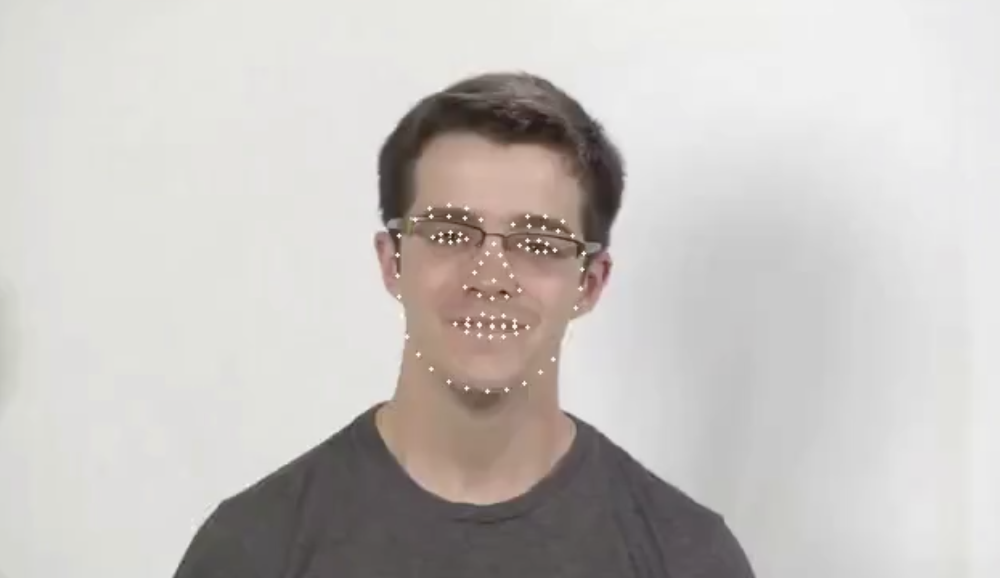
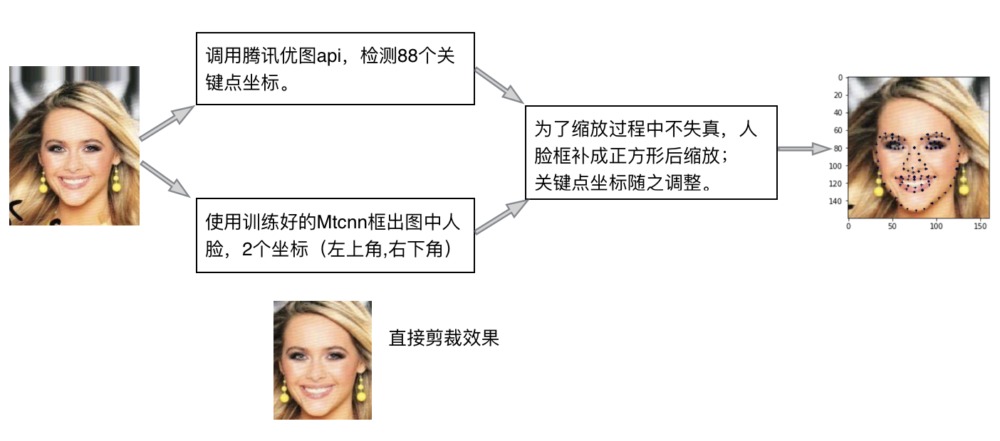
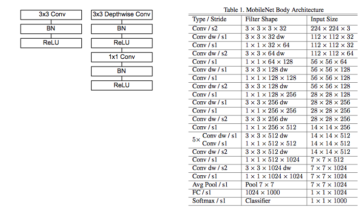
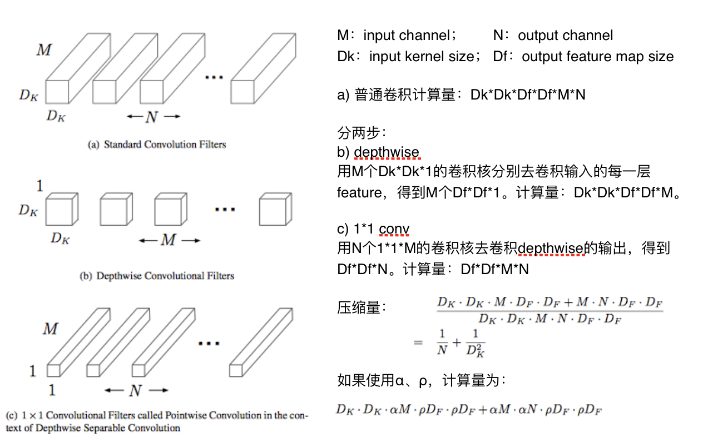

# Facial-Landmark

The main goal of this project is to train an neural network to detect facial landmark(88 points).

### Networks used

1. VGGFace: get a good model, but the size is too big(200MB+).
2. MobileNet: try compress the model, the final model is 3M(67 times smaller), MSE is 1.795(improve 43%), mean absolute error is 0.964.

## Result

I made a video draw facial landmark(88 points) on every frame. See `test_result.mp4` or [link](https://pan.baidu.com/s/1P2NDFNxuTOZ4YU1USRLcBQ) .,

## Dataset
Model input: 160\*160\*3 image
Train：39998 images
Val：2000 images
Test：1999 images

Through `Error Analysis ` , remove images with invalid points.

Train：delete 197 images -> 39801
Val：delete 37 images -> 1935
Test:：1999

**Distribution of 88 points**
face_profile：21points
left_eye：8 points;
right_eye：8 points
left_eyebrow：8 points
right_eyebrow：8 points
mouth： 22 points
nose：13 points

### Data Preprocess

* image original size 178\*218\*3 -> crop facial area -> -> extend to square -> resize -> normalize -> 160\*160\*3 facial image.

* get the train labels(88 points) from Tencent youtu api , adjust points

## Train

#### Transfer learning using VGGFace
Frozen all conv layers parameters, add a full connected layer with 1024 units, add another full connected layer with 186 units as the output. The best Model get MSE 2.56.

#### MobileNet
https://arxiv.org/abs/1704.04861v1 
> We present a class of efficient models called MobileNets for mobile and embedded vision applications. MobileNets are based on a streamlined architecture that uses depth-wise separable convolutions to build light weight deep neural networks. We introduce two simple global hyper-parameters that efficiently trade off between latency and accuracy. These hyper-parameters allow the model builder to choose the right sized model for their application based on the constraints of the problem. We present extensive experiments on resource and accuracy tradeoffs and show strong performance compared to other popular models on ImageNet classification. We then demonstrate the effectiveness of MobileNets across a wide range of applications and use cases including object detection, finegrain classifica-tion, face attributes and large scale geo-localization.

**Architecture**

* use `depthwise` annd` 1x1 conv` replace all `3x3 conv`
* channel number：32 -> 64 -> [128]\*2 -> [256]\*2 -> [512]\*2 if shallow else:[512]\*7 -> 1024 -> AvgPool -> FC -> OutPut

**Compute operation**

The input of our MobileNet model is still 160\*160\*3, the output of all conv layers is  5\*5\*1024, followed by an AvgPooling layer.  And the last layers is a full connect layer with 176 units. (α：0.3；ρ：default 1；shallow)

## Time Cost
Detect face using mtcnn:  69.2ms   
Predict 88 points:  25.2ms    
Total : 97.4ms (test on MacBookPro（Itel i5 cpu）)
